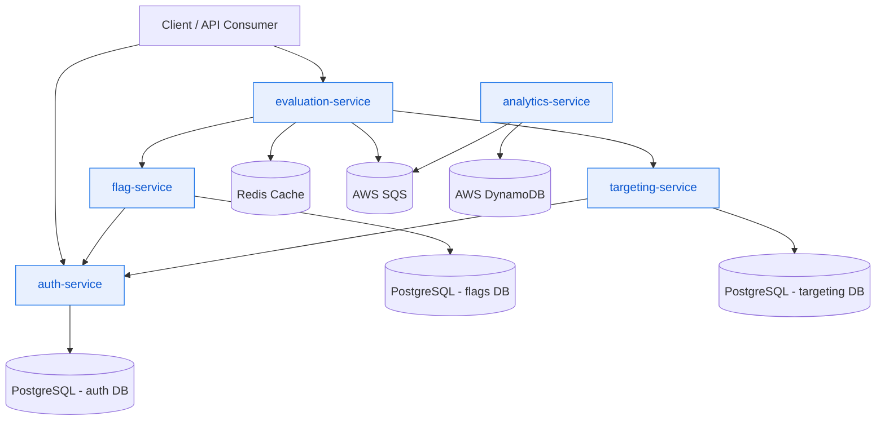
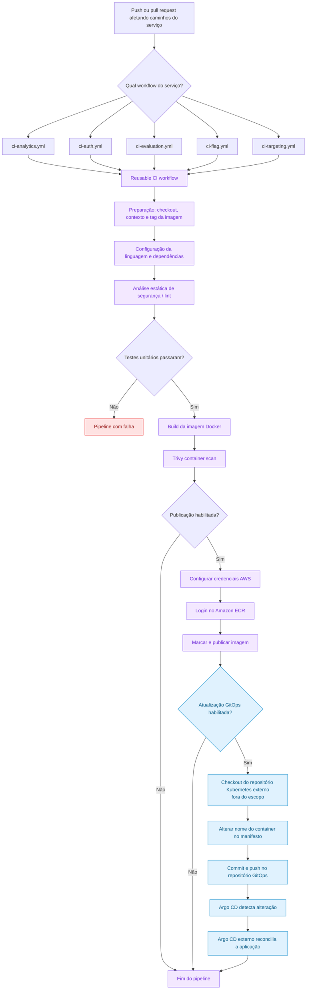
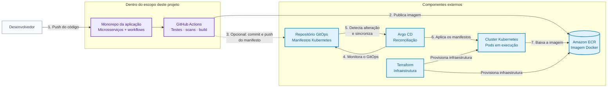

# ToggleMaster — Microsserviços e CI/CD

> **Resumo:** monorepo com cinco microsserviços, pipelines reutilizáveis de
> CI/CD, publicação de imagens no Amazon ECR e integração opcional com um
> repositório GitOps externo. O cluster Kubernetes e o Argo CD não fazem parte
> do escopo deste projeto.

## Índice

- [Microsserviços](#microsserviços)
- [Estrutura do repositório](#estrutura-do-repositório)
- [Infraestrutura e deployment](#infraestrutura-e-deployment)
- [Decisões de arquitetura](#decisões-de-arquitetura)
- [CI / GitHub Actions](#ci--github-actions)
- [Fluxo de relacionamento entre serviços](#fluxo-de-relacionamento-entre-serviços)
- [Fluxo do pipeline de CI/CD](#fluxo-do-pipeline-de-cicd)
- [Documentação do pipeline](#documentação-do-pipeline)
- [Considerações de segurança](#considerações-de-segurança)

## Microsserviços

O projeto é um **monorepo**: os serviços são mantidos no mesmo repositório,
mas possuem código, testes e imagens Docker independentes.

### Serviços disponíveis

| Serviço | Linguagem | Caminho | Dockerfile | Testes |
| --- | --- | --- | :---: | :---: |
| Auth | Go | `services/auth-service-main` | Sim | Sim |
| Flag | Python | `services/flag-service-main` | Sim | Sim |
| Targeting | Go | `services/targeting-service-main` | Sim | Sim |
| Evaluation | Go | `services/evaluation-service-main` | Sim | Sim |
| Analytics | Python | `services/analytics-service-main` | Sim | Sim |

## Estrutura do repositório

```text
tech-challenge-3/
├── services/
│   ├── auth-service-main/
│   ├── flag-service-main/
│   ├── targeting-service-main/
│   ├── evaluation-service-main/
│   └── analytics-service-main/
├── .github/workflows/
│   ├── ci-<service>.yml
│   └── reusable-ci.yml
└── README.md
```

- **Modelo:** monorepo, com CI e serviços no mesmo repositório.
- **Repositório raiz:** `tech-challenge-3`.

## Infraestrutura e deployment

- **Região AWS:** `us-east-1`.
- **Repositórios ECR:** criados automaticamente pelo processo de IaC com
  Terraform.
- **Secrets do GitHub Actions:** `AWS_ACCESS_KEY_ID`,
  `AWS_SECRET_ACCESS_KEY`, `AWS_REGION`, `AWS_SESSION_TOKEN` e,
  quando necessário, `K8S_REPO_TOKEN`.

> **Limite de escopo:** este projeto inclui os microsserviços e seus pipelines
> de CI/CD. O cluster Kubernetes, o Argo CD, a infraestrutura de execução e o
> repositório GitOps de manifestos são componentes externos e não são
> provisionados, configurados ou administrados por este repositório.

## Decisões de arquitetura

### Workflow reutilizável

**Escolha:** workflow reutilizável, parametrizado por serviço.

**Motivo:** centralizar as regras do pipeline e manter a implementação
escalável.

### Nome das imagens Docker

Usar o nome do serviço em letras minúsculas, com palavras separadas por hífen:

```text
auth-service
flag-service
evaluation-service
```

O nome deve ser consistente com os repositórios ECR e com os deployments do
Kubernetes.

### Tags das imagens

Cada build utiliza uma tag baseada no commit:

```text
sha-<shortsha>
```

Exemplo: `sha-a1b2c3d`.

A tag `latest` pode ser mantida apenas para builds da branch principal.

### Gatilhos por caminho

O pipeline deve executar somente quando houver alterações relevantes no serviço
ou em arquivos compartilhados, como:

- `services/auth-service-main/**`
- `services/flag-service-main/**`
- `services/evaluation-service-main/**`
- `services/targeting-service-main/**`
- `services/analytics-service-main/**`
- `docker-compose.yml`
- `.github/workflows/**`

### Ordem dos jobs

```text
build → test → lint → security-scan → docker-build → container-scan → push-ecr
```

> **Importante:** a publicação no ECR deve ocorrer somente após todos os passos
> anteriores passarem e quando a execução for válida para a branch de destino.

## CI / GitHub Actions

Este repositório utiliza o workflow reutilizável do GitHub Actions em
`.github/workflows/reusable-ci.yml`.

Secrets necessários no repositório (adicionar em Settings → Secrets):

- `AWS_ACCESS_KEY_ID` — credencial AWS para publicar no ECR.
- `AWS_SECRET_ACCESS_KEY`.
- `AWS_REGION` — por exemplo, `us-east-1`.
- `AWS_SESSION_TOKEN` — opcional, utilizado com credenciais temporárias, como
  as sessões do AWS Learner Lab.
- `K8S_REPO_TOKEN` — opcional; necessário somente quando a atualização do
  manifesto externo do Kubernetes estiver habilitada.

Como funciona:

- Os workflows de cada serviço em `.github/workflows/ci-<service>.yml` são
  acionados por alterações nos caminhos configurados e chamam o workflow
  reutilizável.
- O workflow reutilizável executa cache de dependências, análise de segurança
  (`gosec` / `pip-audit`), build da imagem Docker com a tag
  `sha-<shortsha>`, análise da imagem com Trivy e, opcionalmente, publicação no
  ECR quando `push` está habilitado (configurado para executar na branch `main`).

Para adicionar um novo serviço:

1. Crie `.github/workflows/ci-<service>.yml` chamando o workflow reutilizável
   com os inputs correspondentes (`service`, `context`, `language`, etc.).
2. Garanta que o serviço tenha um `Dockerfile` no contexto configurado ou
   informe o input `dockerfile`.
3. Configure `push` no workflow chamador como
   `${{ github.ref == 'refs/heads/main' }}` para publicar somente a partir da
   branch `main`.

## Fluxo de relacionamento entre serviços



## Fluxo do pipeline de CI/CD



## Documentação do pipeline

A implementação de CI/CD está centralizada em
[`tech-challenge-3/.github/workflows/reusable-ci.yml`](./tech-challenge-3/.github/workflows/reusable-ci.yml).
Cada serviço possui um workflow chamador (`ci-auth.yml`, `ci-analytics.yml`,
`ci-evaluation.yml`, `ci-flag.yml` ou `ci-targeting.yml`) que fornece os valores
específicos do serviço. Assim, a lógica de build e segurança não é duplicada
entre os cinco serviços.

### Quando os workflows são executados

Cada workflow chamador suporta:

- `workflow_dispatch`, para execução manual pelo GitHub Actions.
- `push`, filtrado pelo diretório do serviço, arquivos compartilhados de
  deployment e arquivos de workflow.
- `pull_request`, com os mesmos filtros de caminho.

O workflow chamador define `push` como
`${{ github.ref == 'refs/heads/main' }}`. Portanto, pull requests e branches
diferentes de `main` validam o código e a imagem sem publicá-la no ECR. Somente
uma execução bem-sucedida na `main` chega ao job de publicação no ECR.

### Etapas do pipeline

O workflow reutilizável executa a seguinte cadeia de dependências:

1. **Preparação**
   - Faz checkout do repositório da aplicação.
   - Resolve o contexto do serviço. Se `context` estiver vazio, o padrão será
     `services/<service>-main`.
   - Cria uma tag de imagem no formato
     `sha-<sete-primeiros-caracteres-do-commit>`.
2. **Verificações de dependências, build e testes**
   - Seleciona Go 1.24 ou Python 3.11 conforme o input `language`.
   - Utiliza cache de dependências quando disponível.
   - Executa `go vet` e `gosec` nos serviços Go.
   - Instala e executa `pytest` e `pip-audit` nos serviços Python.
   - Executa o `tests_command` informado pelo workflow chamador.
   - Uma falha nos testes interrompe todos os jobs dependentes.
3. **Build da imagem Docker**
   - Constrói o Dockerfile configurado usando o contexto resolvido.
   - Marca a imagem local com a tag baseada no commit.
   - Adiciona a tag `latest` na `main`, mas a tag do commit é a necessária para
     rastreabilidade.
4. **Análise do container**
   - Analisa a imagem com Trivy em busca de vulnerabilidades `CRITICAL` e
     `HIGH`.
   - Uma falha na análise impede a publicação.
5. **Publicação no ECR**
   - Executada somente quando `push` é `true`.
   - Configura as credenciais AWS, autentica no ECR e publica a tag do commit.
   - Publica também a tag `latest` quando a referência de origem é `main`.
6. **Atualização opcional do manifesto GitOps**
   - Executada somente quando `update_k8s_manifest` é `true`, `push` é `true` e
     o workflow está na `main`.
   - Faz checkout do repositório externo do Kubernetes.
   - Altera o nome de um container selecionado usando `yq`.
   - Cria um commit e publica a alteração no manifesto.
   - O Argo CD externo detecta a alteração no Git e reconcilia a aplicação.

A etapa do Kubernetes não se conecta diretamente ao cluster e não instala nem
configura o Argo CD. Sua finalidade é criar um evento no Git do repositório
externo monitorado pelo Argo CD. A disponibilidade, configuração e execução do
cluster, do Argo CD e desse repositório GitOps são responsabilidades externas a
este projeto.

### Habilitando a etapa do repositório externo do Kubernetes

A integração com o repositório externo do Kubernetes fica desabilitada por
padrão. Ela somente prepara uma alteração para uma infraestrutura GitOps que
deve existir separadamente. Quando o repositório externo estiver disponível:

1. Crie um secret do GitHub Actions chamado `K8S_REPO_TOKEN`.
2. Conceda ao token somente as permissões necessárias para ler e publicar no
   repositório Kubernetes.
3. Passe o secret e defina os inputs no workflow chamador do serviço.

Exemplo:

```yaml
jobs:
  call:
    uses: ./.github/workflows/reusable-ci.yml
    with:
      service: 'analytics'
      context: 'services/analytics-service-main'
      dockerfile: 'Dockerfile'
      image_name: 'analytics-service'
      language: 'python'
      push: ${{ github.ref == 'refs/heads/main' }}
      tests_command: 'python -m pytest test_app.py -v --tb=short'
      update_k8s_manifest: true
      k8s_repository: 'organization/kubernetes-manifests'
      k8s_manifest_path: 'apps/analytics/deployment.yaml'
      k8s_branch: 'main'
      k8s_container_name: 'analytics-service'
      k8s_new_container_name: 'analytics-service-trigger'
    secrets:
      AWS_ACCESS_KEY_ID: ${{ secrets.AWS_ACCESS_KEY_ID }}
      AWS_SECRET_ACCESS_KEY: ${{ secrets.AWS_SECRET_ACCESS_KEY }}
      AWS_SESSION_TOKEN: ${{ secrets.AWS_SESSION_TOKEN }}
      AWS_REGION: ${{ secrets.AWS_REGION }}
      K8S_REPO_TOKEN: ${{ secrets.K8S_REPO_TOKEN }}
```

`k8s_manifest_path` é relativo à raiz do repositório Kubernetes obtido no
checkout. O manifesto deve conter uma estrutura no formato de um Deployment,
com o container-alvo em `.spec.template.spec.containers[]`. A implementação
atual altera somente o campo `name` do container; ela não altera a tag da
imagem. Portanto, o repositório Kubernetes ou suas convenções de deployment
devem tratar essa mudança de nome como um gatilho intencional para o Argo CD.

Antes de habilitar essa etapa em produção, verifique se:

- O token consegue publicar na branch de destino.
- As regras de proteção da branch permitem a automação ou possuem uma exceção
  aprovada para o bot.
- O Argo CD externo monitora a branch e o caminho do manifesto selecionados.
- O nome antigo do container existe exatamente uma vez.
- O novo nome é válido para o Kubernetes e segue as convenções da aplicação.
- O commit não causa um loop infinito de workflows em nenhum dos repositórios.
- O cluster Kubernetes e o Argo CD estão configurados e operacionais fora deste
  projeto.

### Reproduzindo uma falha no pipeline

O repositório contém um cenário de teste de falha intencionalmente desabilitado
em
[`services/analytics-service-main/test_app.py`](./tech-challenge-3/services/analytics-service-main/test_app.py).
O teste fica comentado por padrão:

```python
# def test_pipeline_failure_scenario():
#     assert False, "Falha intencional para validar o pipeline"
```

Para validar o tratamento de falhas, remova os comentários e publique a
alteração. O comando `pytest` do analytics falhará no job de dependências,
build e testes. Como os jobs seguintes dependem dele, o build Docker, a análise
do container, a publicação no ECR e a atualização opcional do Kubernetes não
serão executados. Comente o teste novamente após a validação.

## Considerações de segurança

### Secrets e credenciais

- Nunca faça commit de chaves AWS, tokens de repositório, senhas de banco ou
  chaves de API no código-fonte.
- Armazene `AWS_ACCESS_KEY_ID`, `AWS_SECRET_ACCESS_KEY`, `AWS_SESSION_TOKEN` e
  `K8S_REPO_TOKEN` como secrets do GitHub Actions.
- Prefira credenciais AWS de curta duração via GitHub OIDC e uma IAM Role, em
  vez de chaves de longa duração.
- Restrinja a IAM Role às ações e aos repositórios ECR necessários.
- Restrinja `K8S_REPO_TOKEN` às permissões mínimas de leitura e escrita
  necessárias para o commit do manifesto.
- Não imprima secrets em comandos shell ou saídas de diagnóstico. O GitHub
  mascara valores conhecidos, mas isso não substitui evitar sua exposição.

### Pull requests e código não confiável

- Não exponha secrets com permissão de escrita a workflows que executem código
  de pull requests não confiáveis.
- Mantenha a publicação restrita a execuções confiáveis na `main`.
- Revise cuidadosamente alterações nos arquivos de workflow: uma mudança pode
  alterar o código executado com credenciais AWS ou de repositório.
- Use branches protegidas e revisões obrigatórias nos repositórios da aplicação
  e do Kubernetes.

### Cadeia de suprimentos de dependências e actions

- As ferramentas de segurança Go são instaladas com `@latest`; fixar uma versão
  revisada é mais seguro e torna os builds reproduzíveis.
- Dependências e ferramentas Python devem ser fixadas ou restringidas por
  lockfiles sempre que possível.
- O comando Python `pip-audit` utiliza atualmente `|| true`, portanto os
  resultados da auditoria são exibidos sem falhar o pipeline. Isso é útil
  durante a adoção, mas permite que vulnerabilidades passem pelo CI. Remova
  `|| true` quando a política estiver pronta para ser obrigatória.
- A etapa do Kubernetes baixa o binário mais recente do `yq` em tempo de
  execução. Fixe uma versão específica e verificada, incluindo checksum, antes
  de considerar isso um controle de produção.
- Revise e fixe as GitHub Actions de terceiros em versões confiáveis ou SHAs de
  commits, conforme a política de dependências do repositório.

### Imagens e integridade do deployment

- Tags baseadas em commit fornecem rastreabilidade e devem ser preferidas em
  relação à publicação de tags mutáveis como `latest`.
- O Trivy bloqueia imagens com vulnerabilidades `CRITICAL` ou `HIGH`, mas
  scanners podem gerar falsos positivos e não substituem assinatura de imagens
  ou políticas de runtime.
- Considere assinar as imagens e exigir a verificação da assinatura no cluster.
- Garanta que os repositórios ECR sejam privados e utilizem políticas de
  ciclo de vida para remover imagens obsoletas.
- A atualização do manifesto Kubernetes é uma operação de escrita no Git.
  Trate o token, a branch de destino e o repositório GitOps externo como
  credenciais de produção e audite cada commit automatizado. O Argo CD e o
  cluster não são gerenciados por este projeto.

### Tratamento de falhas e observabilidade

- Os jobs utilizam `needs`; portanto, uma falha em testes, análise estática,
  build Docker ou Trivy impede a publicação nos estágios seguintes.
- A análise de dependências Python não bloqueia o pipeline atualmente devido a
  `pip-audit -r requirements.txt || true`; monitore os logs até que a política
  obrigatória seja habilitada.
- Mantenha a retenção de logs e artefatos do GitHub Actions adequada. O artefato
  da imagem Docker fica retido por um dia porque é apenas um intermediário entre
  o build e a publicação no ECR.
- Revise os logs de workflows com falha para verificar se argumentos de comando
  ou valores de ambiente foram expostos antes de compartilhá-los externamente.

## Visão geral da arquitetura de entrega

> **Escopo deste projeto:** código dos microsserviços e pipeline de CI/CD.
> **Componentes externos:** Terraform, ECR, repositório GitOps, Argo CD e
> cluster Kubernetes.

