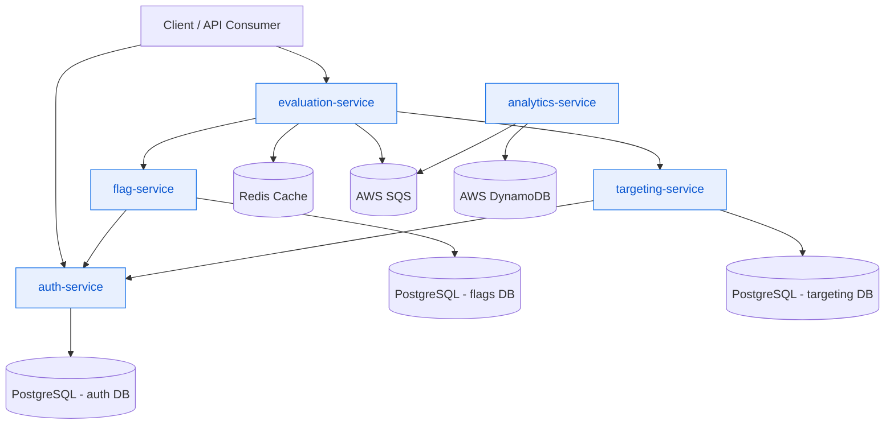
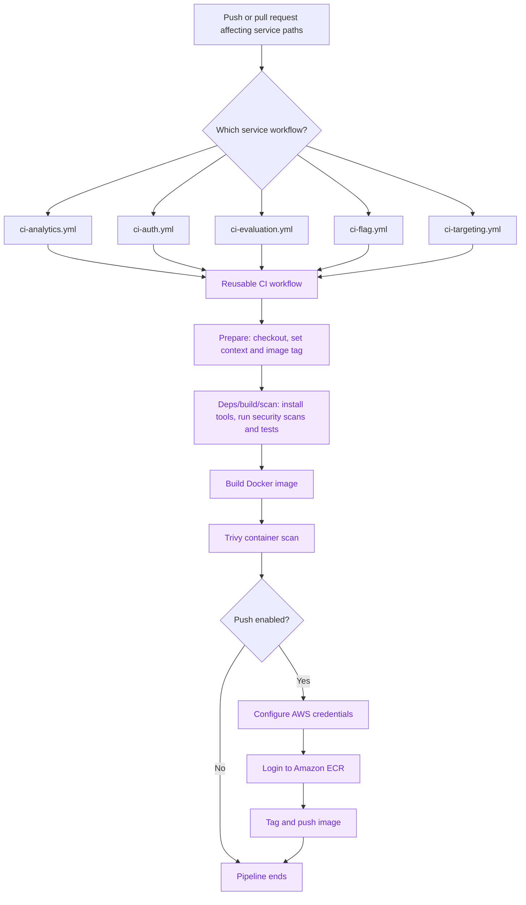

# Service Relationship Flow

```mermaid
flowchart TD
    Client[Client / API Consumer] --> Auth[auth-service]
    Client --> Eval[evaluation-service]

    Auth --> AuthDB[(PostgreSQL - auth DB)]

    Flag[flag-service] --> FlagDB[(PostgreSQL - flags DB)]
    Targeting[targeting-service] --> TargetingDB[(PostgreSQL - targeting DB)]

    Flag --> Auth
    Targeting --> Auth

    Eval --> Flag
    Eval --> Targeting
    Eval --> Redis[(Redis Cache)]

    Eval --> SQS[(AWS SQS)]
    Analytics[analytics-service] --> SQS
    Analytics --> DynamoDB[(AWS DynamoDB)]

    classDef svc fill:#e8f0fe,stroke:#1a73e8,color:#0b57d0;
    class Auth,Flag,Targeting,Eval,Analytics svc;
```

## CI/CD Pipeline Flow

```mermaid
flowchart TD
    A[Push or pull request affecting service paths] --> B{Which service workflow?}
    B --> C[ci-analytics.yml]
    B --> D[ci-auth.yml]
    B --> E[ci-evaluation.yml]
    B --> F[ci-flag.yml]
    B --> G[ci-targeting.yml]

    C --> H[Reusable CI workflow]
    D --> H
    E --> H
    F --> H
    G --> H

    H --> I[Prepare: checkout, set context and image tag]
    I --> J[Deps/build/scan: install tools, run security scans and tests]
    J --> K[Build Docker image]
    K --> L[Trivy container scan]
    L --> M{Push enabled?}
    M -->|Yes| N[Configure AWS credentials]
    N --> O[Login to Amazon ECR]
    O --> P[Tag and push image]
    M -->|No| Q[Pipeline ends]
    P --> Q

    classDef step fill:#f3e8ff,stroke:#8b5cf6,color:#6d28d9;
    class H,I,J,K,L,N,O,P,Q step;
```
