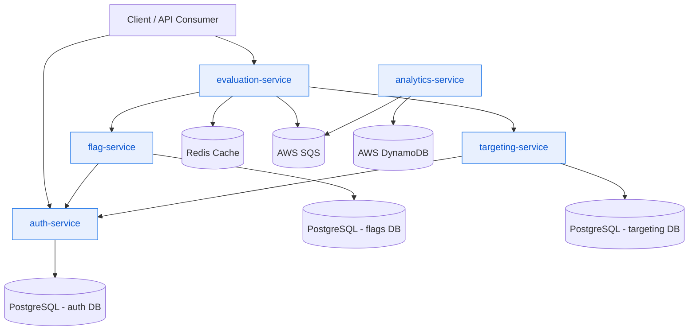

# Service Relationship Flow

```mermaid
flowchart TD
    Client[Client / API Consumer] --> Auth[auth-service]
    Client --> Eval[evaluation-service]

    Auth --> AuthDB[(PostgreSQL - auth DB)]

    Flag[flag-service] --> FlagDB[(PostgreSQL - flags DB)]
    Targeting[targeting-service] --> TargetingDB[(PostgreSQL - targeting DB)]

    Flag --> Auth
    Targeting --> Auth

    Eval --> Flag
    Eval --> Targeting
    Eval --> Redis[(Redis Cache)]

    Eval --> SQS[(AWS SQS)]
    Analytics[analytics-service] --> SQS
    Analytics --> DynamoDB[(AWS DynamoDB)]

    classDef svc fill:#e8f0fe,stroke:#1a73e8,color:#0b57d0;
    class Auth,Flag,Targeting,Eval,Analytics svc;
```
